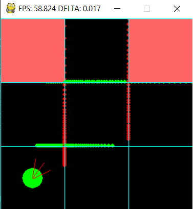
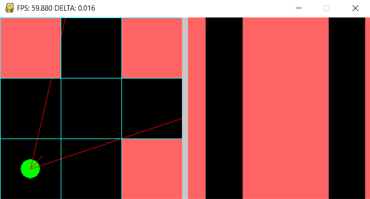
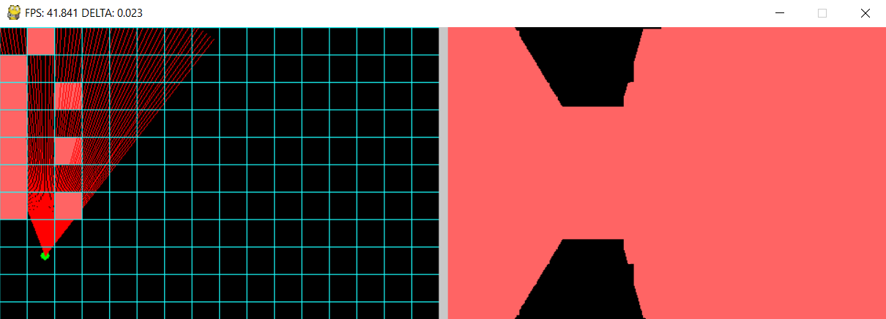
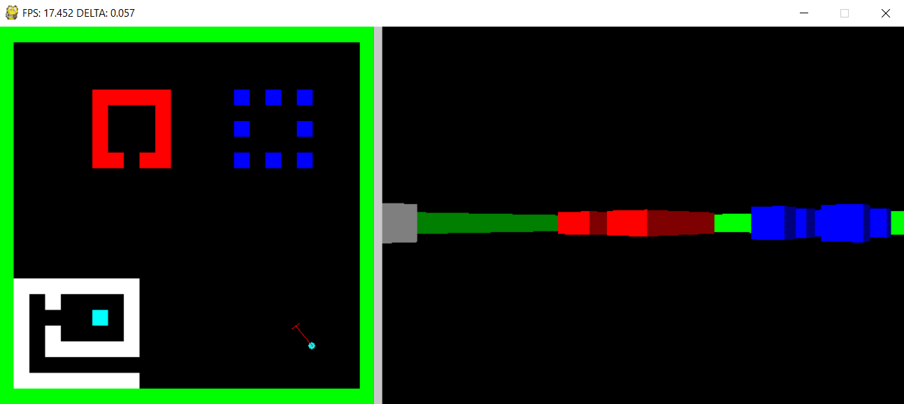

# RaycastPy
A sofware raycasting engine written in Python.

# Project Structure
Project is structured showing the progress during the implementation, going to find rays intersections to the rendering of 2D and 3D scene.

## Rays interception on 2D grid

> Related sources [here](./01-cast/)

## From 2D to 3D rendering

> Related sources [here](./02-map/)

## Final Rendering

> Related sources [here](./04-final/)

# Development
* Python v3.7.3
* Window management and drawing with [PyGame](https://www.pygame.org)
